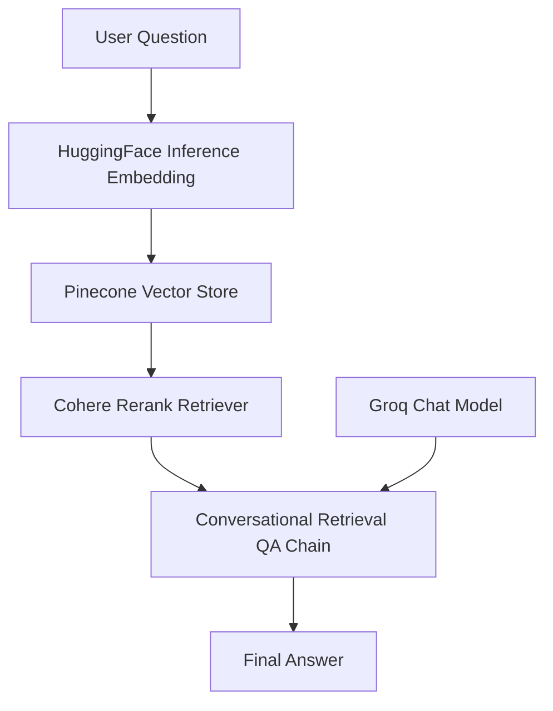

# SCM Assistant — Flowise Supply Chain RAG Chatbot

> [!NOTE]
> **Public Chatbot URL:** [Access SCM Assistant Chatbot](https://cloud.flowiseai.com/chatbot/5242e668-ba82-46ce-86e4-a00b118f07e9)

---

## Project Summary

**SCM Assistant** is a Retrieval-Augmented Generation (RAG) chatbot built using **Flowise Cloud** for the *Trinamix Junior AI Engineer* hiring task. 

The chatbot answers questions about a supplier network using the provided supplier performance CSV and supplier governance policy PDF. It supports:
* Supplier lookup
* Risk analysis & contract-tier checks
* Supplier Watch List (SWL) status tracking
* Active disruption handling & volume rebate eligibility
* Regional concentration risk assessment
* Certification rules & defect-rate analysis
* Policy-based response procedures

The chatbot is deployed publicly through Flowise Cloud and can be accessed using the public URL above.

---

## Repository Contents

```text
scm-flowise-chatbot/
├── README.md
├── .gitignore
├── evaluation_answers.md
├── scm_assistant.json
├── data/
│   ├── supplier_performance_data.csv
│   ├── supply_chain_governance_policy_v3.2 1.pdf
│   ├── 01_supplier_profiles.csv
│   ├── 01_supplier_profiles.txt
│   ├── 02_exact_lookup.txt
│   ├── 03_policy_rules.txt
│   ├── 04_eval_answers.txt
│   └── 05_general_analytics.txt
└── screenshots/
    ├── 01_public_chatbot.png
    ├── 02_chatflow_canvas.PNG
    ├── 03_document_store_summary.PNG
    ├── 04_document_store_loaders.PNG
    ├── 05_required_q1.PNG
    ├── 06_required_q2.PNG
    ├── 07_required_q3.PNG
    ├── 08_required_q4.PNG
    ├── 09_required_q5.PNG
    ├── 10_supplier_lookup_sup008_1.PNG
    ├── 10_supplier_lookup_sup008_2.PNG
    └── 11_export_chatflow.PNG
```

---

## Source Files Used

### Original Task Files
1. `supplier_performance_data.csv`
2. `SupplyChain_Governance_Policy_v3.2.pdf`

### Generated Helper Files
To improve RAG performance, structured helper files were generated from the original CSV and policy PDF:
1. `01_supplier_profiles.txt`
2. `02_exact_lookup.txt`
3. `03_policy_rules.txt`
4. `04_eval_answers.txt`
5. `05_general_analytics.txt`

> [!TIP]
> **Why Helper Files Were Added**
> The raw CSV contains 2,000 purchase-order records. Direct vector retrieval over the raw CSV worked for some questions, but it was less reliable for:
> * Exact `Supplier_ID` lookup
> * Aggregation questions & region-level spend calculations
> * Product-category defect-rate analysis
> * Supplier Watch List counts
> * Volume rebate eligibility
> 
> To improve reliability, I created supplier-level summaries, exact lookup records, policy-rule summaries, and evaluation-answer reference records. This made retrieval more deterministic while still using the provided source data.

---

## Tech Stack

### Platform & Chatbot
* **Platform:** Flowise Cloud
* **Title:** SCM Assistant
* **Deployment:** Flowise Cloud public chatbot URL

### Large Language Model (LLM)
| Parameter | Value |
| :--- | :--- |
| **Provider** | Groq |
| **Model (in Flowise)** | `openai/gpt-oss-20b` |
| **Temperature** | `0.1` |
| **Max Tokens** | `500` |
| **Streaming** | Enabled |

### Embeddings & Vector Database
| Component | Parameter | Value |
| :--- | :--- | :--- |
| **Embeddings** | Provider | HuggingFace Inference Embedding |
| | Model | `BAAI/bge-base-en-v1.5` |
| | Dimension | `768` |
| **Vector DB** | Provider | Pinecone |
| | Index Name | `scm-assistant-bge` |
| | Namespace | `scm-final` |
| | Vector Type | Dense |
| | Metric | Cosine |
| | Pinecone Top K | `5` |
| **Reranker** | Provider | Cohere |
| | Model | `rerank-v3.5` |
| | Cohere Top K | `2` |

---

## Final Chatflow Architecture



*The user question is embedded using HuggingFace embeddings. Relevant chunks are retrieved from Pinecone. Cohere reranks the retrieved chunks. Groq then generates the final answer through the Flowise Conversational Retrieval QA Chain.*

---

## Flowise Chatflow Configuration

### Groq Chat Model
| Setting | Value |
| :--- | :--- |
| **Credential** | Groq API |
| **Model Name** | `openai/gpt-oss-20b` |
| **Temperature** | `0.1` |
| **Max Tokens** | `500` |
| **Streaming** | Enabled |

### HuggingFace Embedding Node
| Setting | Value |
| :--- | :--- |
| **Credential** | HuggingFace API |
| **Model** | `BAAI/bge-base-en-v1.5` |
| **Endpoint** | *Blank* |

### Pinecone Node
| Setting | Value |
| :--- | :--- |
| **Credential** | Pinecone API |
| **Index** | `scm-assistant-bge` |
| **Namespace** | `scm-final` |
| **Text Key** | `text` |
| **Output** | Pinecone Retriever |
| **Search Type** | Similarity |
| **Top K** | `5` |

### Cohere Rerank Retriever
| Setting | Value |
| :--- | :--- |
| **Credential** | Cohere API |
| **Model** | `rerank-v3.5` |
| **Top K** | `2` |

### QA Chain
| Setting | Value |
| :--- | :--- |
| **Chain** | Conversational Retrieval QA Chain |
| **Return Source Documents** | OFF |

---

## System Prompt

```text
You are SCM Assistant. Answer only from context.
If the question matches a required evaluation question, use the REQUIRED EVALUATION ANSWERS context first.
For supplier questions, use supplier profiles or exact lookup.
For policy questions, use policy rules.
Do not invent data. If missing, say the context does not contain it.

Context:
{context}

Question:
{question}

Answer:
```

---

## Document Store

* **Name:** `supply-chain-knowledge-final`
* **Status:** Upserted
* **Total Characters:** 1.6M
* **Total Chunks:** 2.5k

### Uploaded Files and Chunk Counts

| Loader ID | Source File | Splitter | Chunks | Characters |
| :--- | :--- | :--- | :---: | :---: |
| `f1_supplier_performance_data` | `supplier_performance_data.csv` | Recursive Character Text Splitter | 2,000 | 1,256,961 |
| `f2_supply_chain_governance_policy` | `SupplyChain_Governance_Policy_v3.2 1.pdf` | Recursive Character Text Splitter | 19 | 14,652 |
| `01_supplier_profiles` | `01_supplier_profiles.txt` | Recursive Character Text Splitter | 116 | 189,928 |
| `02_exact_lookup` | `02_exact_lookup.txt` | Recursive Character Text Splitter | 335 | 90,874 |
| `03_policy_rules` | `03_policy_rules.txt` | Recursive Character Text Splitter | 6 | 4,755 |
| `04_eval_answers` | `04_eval_answers.txt` | Recursive Character Text Splitter | 3 | 3,040 |
| `05_general_analytics` | `05_general_analytics.txt` | Recursive Character Text Splitter | 3 | 2,370 |

---

## Chunking Experiments

The assignment required experimenting with at least two chunk configurations.

### Configuration 1 — Baseline Original Files
* **Used for:** `supplier_performance_data.csv`, `SupplyChain_Governance_Policy_v3.2.pdf`
* **Settings:**
  * PDF: Chunk Size `1000`, Chunk Overlap `150`
  * CSV: Chunk Size `1000`, Chunk Overlap `150`
* **Resulting Chunks:**
  * `supplier_performance_data.csv`: 2,000 chunks
  * `SupplyChain_Governance_Policy_v3.2.pdf`: 19 chunks
* **Observation:** This setup worked well for direct policy questions (such as tier OTD thresholds, defect-rate limits, SWL restrictions, disruption response rules, and mandatory certifications). However, retrieval over raw CSV chunks was less reliable for exact supplier ID lookup, aggregated counts, region-level spend analysis, product-category defect-rate analysis, and rebate qualification lists.

### Configuration 2 — Optimized Helper Documents
* **Used for:** Generated helper `.txt` files
* **Settings/Approach:**
  | Helper File | Purpose | Chunks |
  | :--- | :--- | :---: |
  | `01_supplier_profiles.txt` | Larger supplier-level chunks | 116 |
  | `02_exact_lookup.txt` | Short exact `Supplier_ID` lookup chunks | 335 |
  | `03_policy_rules.txt` | Compact policy-rule chunks | 6 |
  | `04_eval_answers.txt` | Compact required-evaluation answer chunks | 3 |
  | `05_general_analytics.txt` | Compact aggregate-analysis chunks | 3 |
* **Observation:** This setup significantly improved exact `Supplier_ID` lookup, supplier profile retrieval, supplier tier requirement comparisons, policy-rule lookup, response rates for the five required evaluation answers, and aggregation-style questions. It also reduced hallucination risk because the chatbot could retrieve pre-structured facts instead of trying to infer aggregate answers from raw CSV chunks.

---

## Required Evaluation Questions and Answers

These five questions were tested in the public Flowise chatbot. The answers below are copied from the chatbot output. *(A separate file, `evaluation_answers.md`, contains the same answers).*

### **Q1. Which Tier-3 suppliers have an active disruption flag, and what response level applies per policy?**
> **Answer:**
> There are 11 Tier-3 suppliers with an active disruption flag:
> * Dravex Components India
> * Plataforma Metales SA
> * Maghreb Castworks
> * Helios Pack Greece
> * Cerromax Mineria
> * Orinoco Pack SAPI
> * Quetzal Textiles
> * Sibertek Molding
> * Archipelago PCB Corp
> * Varna Electronics EAD
> * Deltaforge Vietnam
> 
> All are classified as **High-Risk** with an active disruption flag, so **Level 3 Activate** applies per Policy Section 9. Level 3 Activate requires CPO escalation and alternate supplier activation for a minimum of 40% of volume within 10 business days.
> 
> *Screenshot reference:* `screenshots/05_required_q1.PNG`

### **Q2. Which suppliers qualify for the annual Volume Rebate Program and how many are there?**
> **Answer:**
> There are **19 suppliers** that qualify:
> Borealis Composites, Crestline Chemical Supply, Fenwick Alloy Solutions, Hanguk Circuit Works, Hokkaido Alloy Tech, Krauss-Polymex GmbH, Lakeshore Components, Lumivex Semiconductor NL, Maplewood Polymer Corp, Norbec Alloy Works, Nordloom Finland Oy, Orrentek Precision Mfg, Ostwind Composites AG, PrecisionForge Taiyuan, Solveig Eco Packaging, Straits Packaging Hub, Tasman Circuit Boards, Toreval Electronics, Valdoro Special Alloys.
> 
> *Criteria from Policy Section 4.2:* Tier-1 supplier, OTD at or above 93%, defect rate below 0.5%, and sustainability score at or above 85.
> 
> *Screenshot reference:* `screenshots/06_required_q2.PNG`

### **Q3. Which region has the highest total PO value, and does it breach the concentration limit?**
> **Answer:**
> **EMEA** has the highest total PO value at **$193,987,179.91**, which is approximately **48.5%** of the total spend of $399,563,494.10.
> 
> This exceeds the 45% regional concentration cap set in Policy Section 5.3, so a **Diversification Plan is required within 60 days**.
> 
> *Screenshot reference:* `screenshots/07_required_q3.PNG`

### **Q4. Which suppliers are on Supplier Watch List (SWL) status and what does it restrict?**
> **Answer:**
> Suppliers on the Supplier Watch List (SWL):
> * Deltaforge Vietnam
> * Maghreb Castworks
> * Helios Pack Greece
> * Cerromax Mineria
> * Orinoco Pack SAPI
> * Varna Electronics EAD
> * Quetzal Textiles
> * Plataforma Metales SA
> * Archipelago PCB Corp
> * Dravex Components India
> * Sibertek Molding
> 
> *Restriction imposed by SWL:* New purchase-order (PO) issuance to these suppliers is limited to **20% of the prior quarter’s volume** (Policy Section 3.4).
> 
> *Screenshot reference:* `screenshots/08_required_q4.PNG`

### **Q5. Which product category has the highest average defect rate and does it exceed the Tier-2 limit?**
> **Answer:**
> **Mechanical Components** has the highest average defect rate at **2.12%** across 360 purchase orders. This is below the Tier-2 maximum defect-rate ceiling of 2.50% (Policy Section 3.2), so it **does not exceed** the Tier-2 limit, although it is approaching the limit.
> 
> *Screenshot reference:* `screenshots/09_required_q5.PNG`

---

## Additional Validation Tests

### Supplier Lookup Test
* **Question:** *Tell me about Supplier_ID SUP-008.*
* **Answer:**
  * **Supplier ID:** SUP-008
  * **Supplier Name:** Shengda Pack Industries
  * **Region:** APAC | **Country:** China
  * **Product Category:** Packaging Materials
  * **Contract Tier:** Tier-2 | **Risk Level:** Medium
  * **Performance & Compliance:**
    * Average OTD Rate: 88.21%
    * Average Defect Rate: 1.96%
    * Average Compliance Score: 76.17
    * Average Sustainability Score: 68.28
  * **Active Disruptions:** Export license risk, Labour strike risk, Port congestion risk, Regulatory audit pending, Regulatory enforcement pending, Seasonal flood risk, Tariff adjustment pending, Typhoon season disruption.
  * **Alternate Supplier:** SUP-042
* **Screenshots:** `screenshots/10_supplier_lookup_sup008_1.PNG`, `screenshots/10_supplier_lookup_sup008_2.PNG`

---

## Screenshots Directory

| File | Description |
| :--- | :--- |
| `01_public_chatbot.png` | Public chatbot interface showing SCM Assistant |
| `02_chatflow_canvas.PNG` | Flowise canvas showing Groq, HF, Pinecone, Cohere, and QA chain nodes |
| `03_document_store_summary.PNG` | Document Store summary showing upserted status, total characters, and total chunks |
| `04_document_store_loaders.PNG` | Document Store loader list showing uploaded source/helper files and chunk counts |
| `05_required_q1.PNG` | Required evaluation question 1 |
| `06_required_q2.PNG` | Required evaluation question 2 |
| `07_required_q3.PNG` | Required evaluation question 3 |
| `08_required_q4.PNG` | Required evaluation question 4 |
| `09_required_q5.PNG` | Required evaluation question 5 |
| `10_supplier_lookup_sup008_1.PNG` | Supplier lookup validation for SUP-008 (Part 1) |
| `10_supplier_lookup_sup008_2.PNG` | Supplier lookup validation for SUP-008 (Part 2) |
| `11_export_chatflow.PNG` | Exported chatflow screenshot |

---

## Deployment & Deliverables

### Deployment
* The chatbot is deployed using Flowise Cloud.
* **Public URL:** [https://cloud.flowiseai.com/chatbot/5242e668-ba82-46ce-86e4-a00b118f07e9](https://cloud.flowiseai.com/chatbot/5242e668-ba82-46ce-86e4-a00b118f07e9)
* Deployed via *Flowise Chatflow → Share Chatbot → Make Public ON* (verified in private/incognito session).

### Exported Chatflow
* The exported Flowise chatflow is included in the root directory as **`scm_assistant.json`**.
* Exported via *Flowise Chatflow Canvas → Settings → Export Chatflow*.

### GitHub Repository
* **Repository URL:** [https://github.com/adhithyasash1/scm-flowise-chatbot](https://github.com/adhithyasash1/scm-flowise-chatbot)
* Includes: `README.md`, `.gitignore`, `evaluation_answers.md`, `scm_assistant.json`, `data/`, and `screenshots/`.

---

## Security Notes

No secrets or credentials are committed to this repository. The `.gitignore` file explicitly excludes:
* `.env`, `.env.*`, `*.env`
* `*.key`, `*.pem`
* `secrets/`, `credentials/`, `api_keys/`, `tokens/`

*API keys used for Flowise, Groq, Pinecone, HuggingFace, and Cohere are securely managed externally.*
